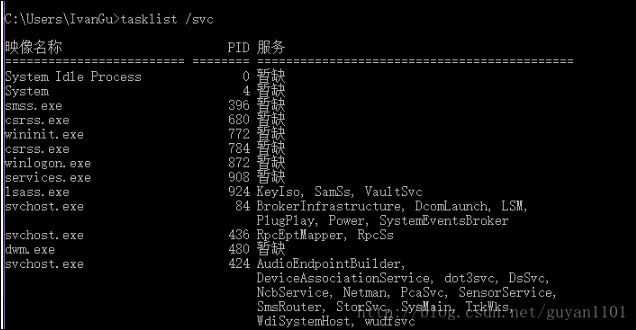

>Windos用控制台关闭某个程序

<!--more-->

1. 首先进入cmd页面
2. 在cmd命令行下输入tasklist/svc 就可以看到计算机当前正在运行程序以及对应的PID,通过程序名和ID号可以对程序的开启进行操作
   

3. 如果要关闭某个程序：taskkill /f /im “程序名称”,之后可以看到对应服务一栏的状态改变,显示为暂缺即已经关闭该程序
4. 使用dos命令行可以对正在运行的程序进行进行管理,对于多桌面任务的管理是十分有用的,同样在脚本中可以完成多个指令的输入,来关闭多个耗费大量资源的程序,有助于电脑的正常工作.

* [1] [Windows CMD模式下关闭应用程序](https://blog.csdn.net/guyan1101/article/details/72817956)