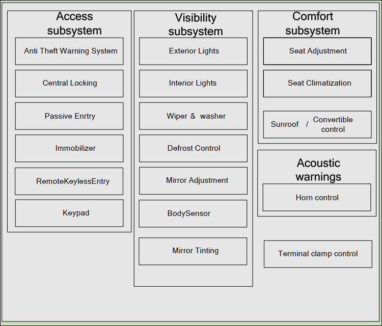

> Autosar相关的学习文档

<!--more-->

> 参考autosar版本  

- [0.General](#0general)
- [1.Application](#1application)
  - [1.1 BodyAndComfort](#11-bodyandcomfort)
    - [1.1.1 术语表](#111-术语表)
    - [1.1.2 逻辑分解图](#112-逻辑分解图)
    - [1.1.3 功能描述](#113-功能描述)
  - [1.2 HMI](#12-hmi)
  - [1.3 Chassis](#13-chassis)
  - [1.4 Powertrain](#14-powertrain)
  - [1.5 Safety](#15-safety)
- [2.Runtime Environment](#2runtime-environment)
- [3.System Services](#3system-services)

# 0.General

> 术语列表

| Abbreviation | Meaning                                 | Comment      |
| ------------ | --------------------------------------- | ------------ |
| .arxml       | Autosar Extensible Markup Language File |              |
| AI Table     | Application Interface Table             | 应用层接口表 |
| Bugzilla     | Tool for change request management      |              |
| CPU          | Central Processing Unit                 |              |
| ECU          | Electronic Control Unit                 |              |
| Excel        | Microsoft spreadsheet-application       |              |
| MS           | Milestone                               |              |
| RTE          | Run-Time Environment                    |              |
| SPEM         | Software Process Engineering meta-model |              |
| SVN          | Subversion (version control system)     |              |
| SW-C         | SoftwareComponent                       |              |
| SWC          | SoftwareComponent                       |              |
| SW           | Software                                |              |
| VB           | Visual Basic                            |              |
| VFB          | Virtual Function Bus                    | 虚拟功能总线 |
| WP           | Work package                            |              |
| XML          | Extensible Markup Language              |              |
| XSD          | XML Schema Definition                   |              |
| HMI          | Human Machine Interface                 |              |
# 1.Application

## 1.1 BodyAndComfort

> 参考文档   `AUTOSAR_EXP_AIBodyAndComfort.pdf`

主要介绍车身域控制模块的相关标准化的逻辑

### 1.1.1 术语表

| Abbreviation | Meaning                                   | Comment |
| ------------ | ----------------------------------------- | ------- |
| ATWS         | Anti-Theft Warning System                 |         |
| BBS          | Battery Backed Sensor                     |         |
| CAN          | Controller Area Network                   |         |
| CHLH         | Coming Home/Leaving Home                  |         |
| CL           | Central Locking                           | 中控锁  |
| ECM          | Engine Control Module                     |         |
| GBS          | Glass Brake Sensor                        |         |
| ID           | Identity                                  |         |
| IMMO         | Immobilizer                               |         |
| INCL         | Inclination sensor                        |         |
| ISC          | Interior Scanner                          |         |
| LED          | Light-Emitting Diode                      |         |
| LHFD         | Left Hand Front Door                      |         |
| LHRD         | Left Hand Rear Door                       |         |
| RKE          | Remote Keyless Entry                      |         |
| HVAC         | Heating, Ventilation and Air Conditioning |         |
| DC           | Defrost Control                           |         |
| SC           | Seat Climatization                        |         |
| SA           | Seat Adjustment                           |         |

### 1.1.2 逻辑分解图

### 1.1.3 功能描述

* Wiper/Washer
* Mirror Adjustment & Tinting
* Interior Light
* Seat Adjustment
* Central Locking
* Exterior Light
* Antitheft Warning System
* Horn
* Defrost Control
* Terminal Clamp Control
* Immobilizer
* Seat Climatization
* PASE (PASsive Entry)
* RKE (Remote Keyless Entry)
* Convertible Control
* BodySensors
* KeyPad

## 1.2 HMI

## 1.3 Chassis

## 1.4 Powertrain

## 1.5 Safety

# 2.Runtime Environment

# 3.System Services

> 参考文档

* [1]  AUTOSAR_EXP_AIUserGuide.pdf
* [2]  AUTOSAR_EXP_LayeredSoftwareArchitecture.pdf
* [3]  [如何快速学习AUTOSAR？](https://posts.careerengine.us/p/6211c83d544cc734d1e0bc92) 
* [4]  [AUTOSAR-文档阅读](https://www.cnblogs.com/still-smile/p/12446970.html)