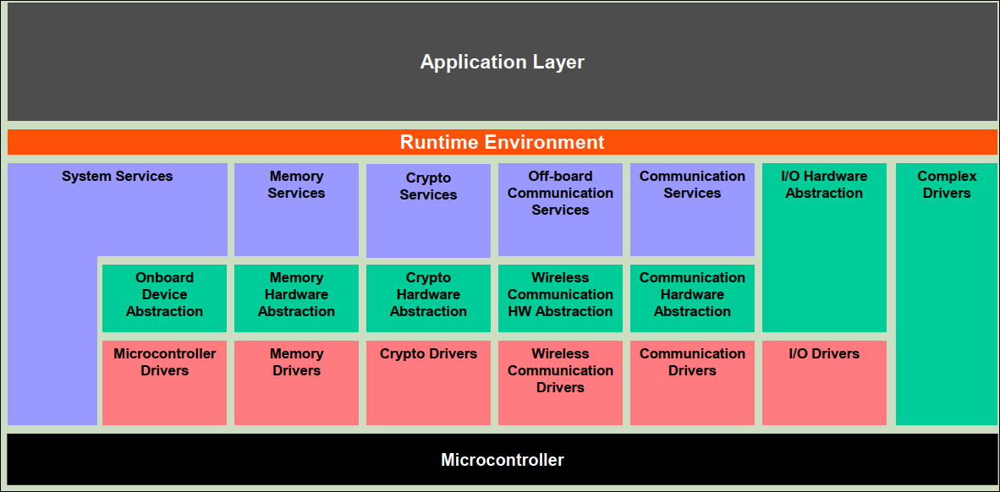

> Autosar相关的学习文档

<!--more-->

> 参考autosar版本  autosar4.3

- [0.General](#0general)
- [1.Application](#1application)
- [2.Runtime Environment](#2runtime-environment)
- [3.System Services](#3system-services)

# 0.General

# 1.Application

# 2.Runtime Environment

# 3.System Services

> 参考文档

* [1]  AUTOSAR_EXP_AIUserGuide.pdf
* [2]  AUTOSAR_EXP_LayeredSoftwareArchitecture.pdf
* [3]  [如何快速学习AUTOSAR？](https://posts.careerengine.us/p/6211c83d544cc734d1e0bc92) 
* [4]  [AUTOSAR-文档阅读](https://www.cnblogs.com/still-smile/p/12446970.html)